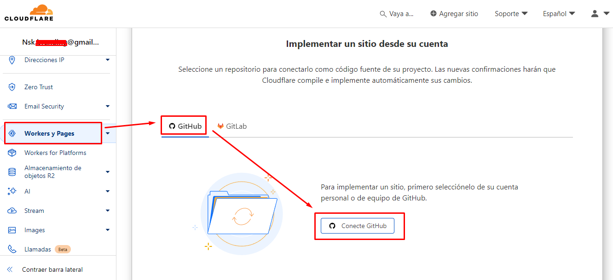
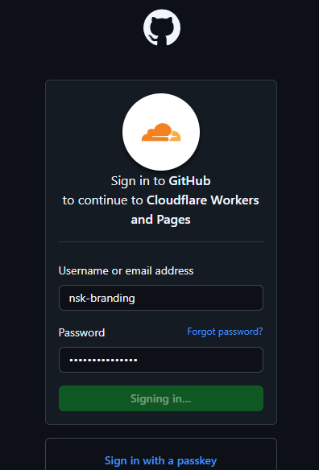
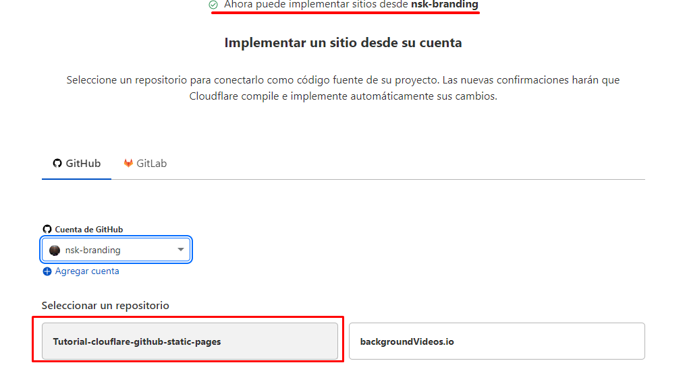
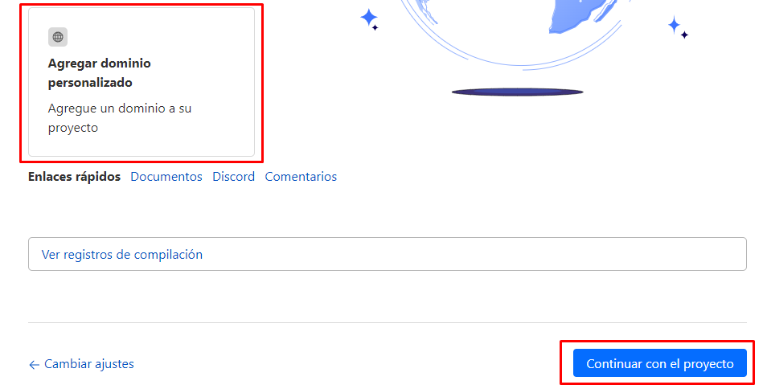
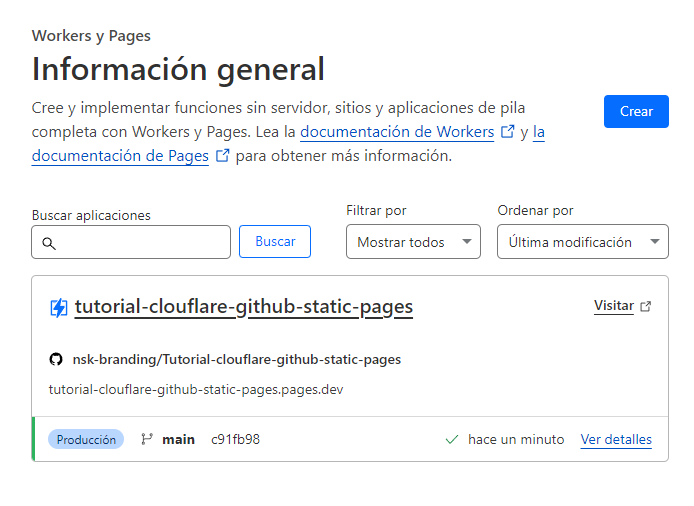

# Tutorial-clouflare-github-static-pages
 clone your github repo to cloudflare and deploy a static web page

 # Documentation: 
 
 https://developers.cloudflare.com/pages/framework-guides/deploy-anything/

 # YouTube tutorials: 
 
 1. https://www.youtube.com/watch?v=MTc2CTYoszY

 2. https://www.youtube.com/watch?v=MTc2CTYoszY

 3. https://www.youtube.com/watch?v=hhsokQb1sxc&t

----------------------

(After implementation, the name of the repository remains with the .dev extension)

💻 Here are some images with the step-by-step process.

---------------------------

#Cloudflare web:

https://tutorial-clouflare-github-static-pages.pages.dev/
